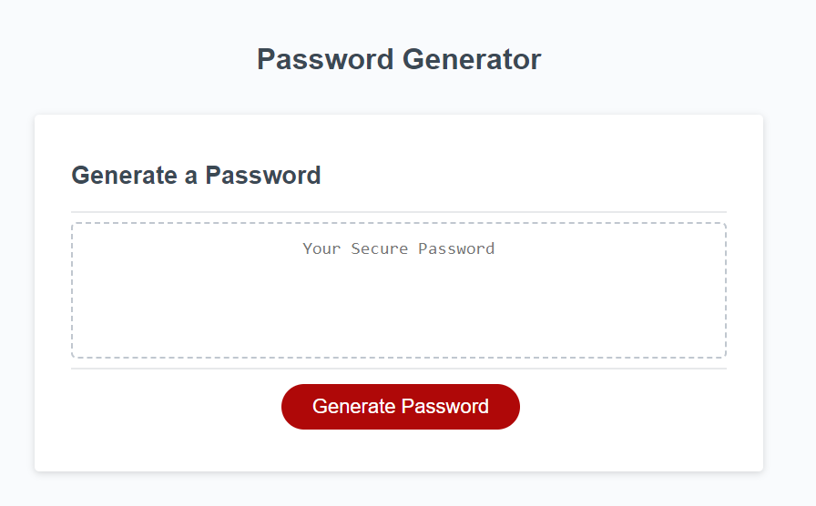

# Password Generator

## Description

Created the Javascript to generate a password. Prompted user to select the inputs they would like to include and the length of the password. If no inputs selected, or if the length was notwithin the range specified, user is informed they need to start over, and why they are needing to start over.

## Usage

Screenshot

## Deployed Application

https://jenwariner19.github.io/password-generator/

## Languages

Javascript
